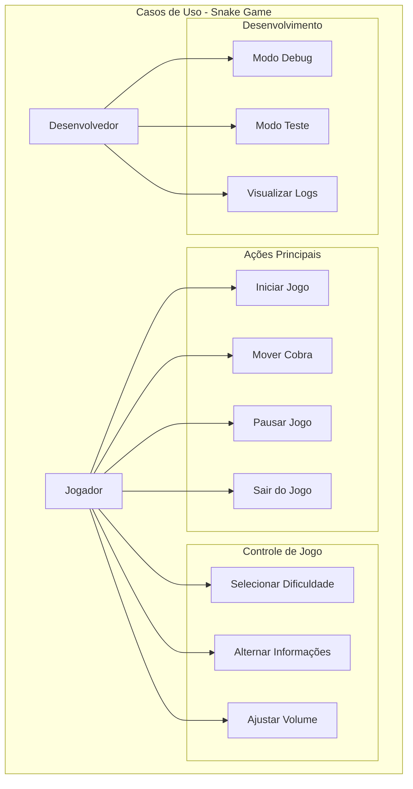
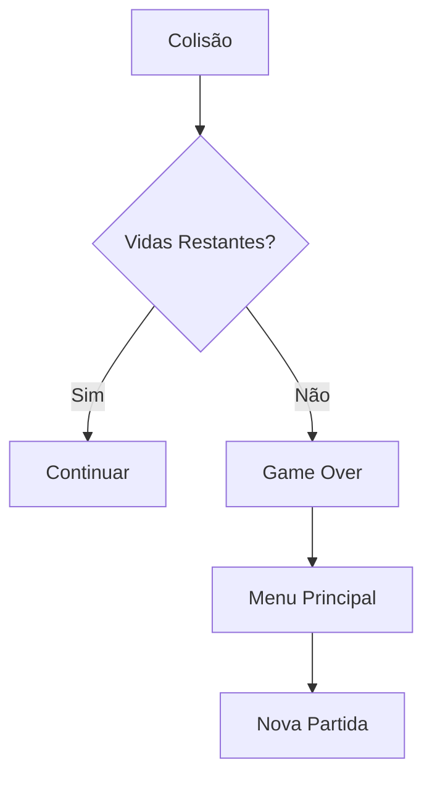
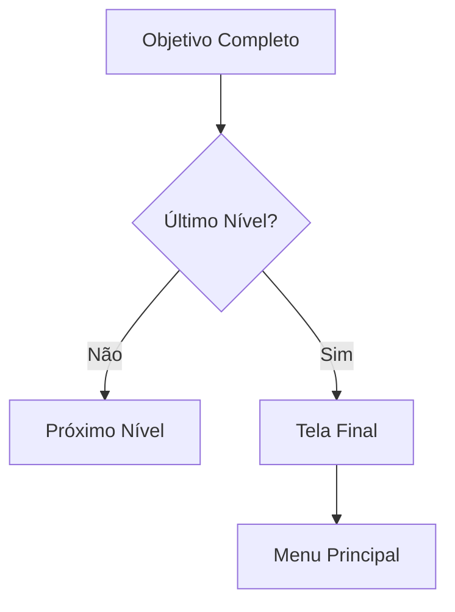

# Diagrama de Casos de Uso

# Detalhamento dos Casos de Uso

## 1. Ações do Jogador

### 1.1 Iniciar Jogo
- **Ator**: Jogador
- **Descrição**: Inicia uma nova partida
- **Fluxo Principal**:
  1. Selecionar dificuldade
  2. Pressionar Enter
  3. Jogo começa no nível 1

### 1.2 Mover Cobra
- **Ator**: Jogador
- **Descrição**: Controla direção da cobra
- **Controles**:
  - Seta para cima
  - Seta para baixo
  - Seta para esquerda
  - Seta para direita

### 1.3 Pausar Jogo
- **Ator**: Jogador
- **Descrição**: Pausa/despausa o jogo
- **Ação**: Pressionar 'P'

### 1.4 Sair do Jogo
- **Ator**: Jogador
- **Descrição**: Encerra o programa
- **Fluxo**:
  1. Pressionar 'S'
  2. Confirmar saída

## 2. Configurações

### 2.1 Selecionar Dificuldade
- **Ator**: Jogador
- **Opções**:
  - Fácil
  - Médio
  - Difícil
- **Impacto**:
  - Velocidade inicial
  - Progressão de dificuldade

### 2.2 Alternar Informações
- **Ator**: Jogador
- **Descrição**: Mostra/oculta HUD
- **Informações**:
  - Pontuação
  - Nível
  - Vidas
  - Tamanho da cobra

### 2.3 Ajustar Volume
- **Ator**: Jogador
- **Controles**: +/-
- **Elementos**:
  - Música de fundo
  - Efeitos sonoros

## 3. Desenvolvimento

### 3.1 Modo Debug
- **Ator**: Desenvolvedor
- **Ativação**: `-show`
- **Funcionalidades**:
  - Informações em tempo real
  - Estado do jogo
  - Posições
  - Performance

### 3.2 Modo Teste
- **Ator**: Desenvolvedor
- **Opções**:
  - `-maxlevel`: Último nível
  - `-endscreen`: Tela final
- **Propósito**: Testes específicos

### 3.3 Visualizar Logs
- **Ator**: Desenvolvedor
- **Ativação**: `-log`
- **Dados**:
  - Eventos do jogo
  - Estados
  - Erros
  - Métricas

# Fluxos Alternativos

## 1. Game Over

## 2. Progressão de Nível

# Restrições e Regras

1. **Movimento**
   - Não pode reverter direção
   - Movimento contínuo
   - Velocidade aumenta por nível

2. **Colisões**
   - Com paredes
   - Com próprio corpo
   - Com comida (positivo)

3. **Pontuação**
   - Base por comida
   - Multiplicador por vidas
   - Bônus por tempo

4. **Progressão**
   - 30 níveis totais
   - Aumento gradual de dificuldade
   - Objetivos específicos por nível
