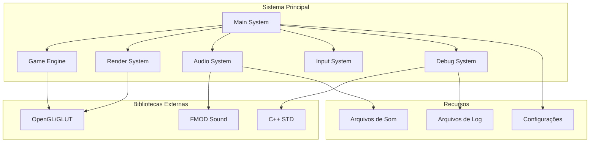
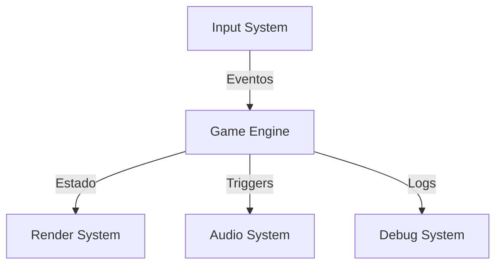
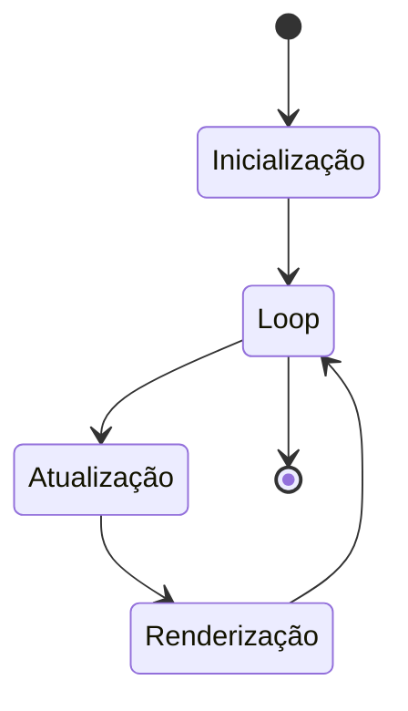
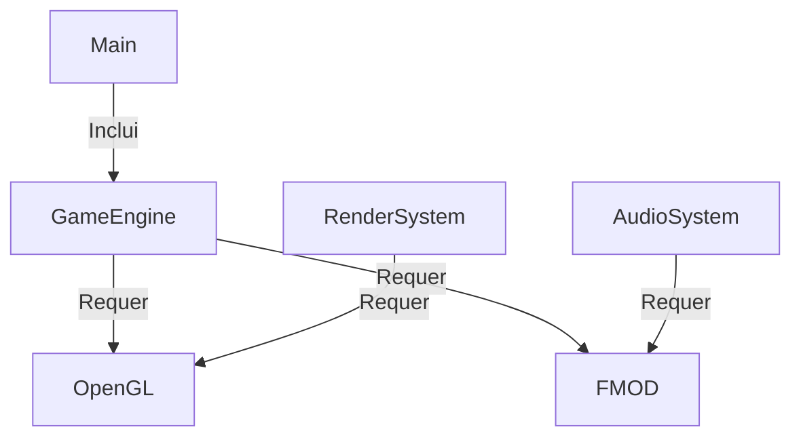

# Diagrama de Componentes

# Arquitetura do Sistema

## 1. Componentes Principais

### 1.1 Main System
- Controle principal do programa
- Inicialização de subsistemas
- Gerenciamento de estados
- Loop principal do jogo

### 1.2 Game Engine
- Lógica do jogo
- Física
- Colisões
- Regras do jogo

### 1.3 Render System
- Interface OpenGL
- Renderização de objetos
- Gerenciamento de texturas
- Interface do usuário

### 1.4 Audio System
- Interface FMOD
- Gerenciamento de sons
- Controle de volume
- Efeitos sonoros

### 1.5 Input System
- Captura de entrada
- Mapeamento de teclas
- Controle de estados

### 1.6 Debug System
- Logging
- Informações em tempo real
- Ferramentas de desenvolvimento

## 2. Dependências Externas

### 2.1 OpenGL/GLUT
- Versão: 3.7.6
- Responsável por:
  - Renderização 2D
  - Janela do jogo
  - Eventos de sistema

### 2.2 FMOD Sound
- Versão: 3.75
- Responsável por:
  - Sistema de áudio
  - Efeitos sonoros
  - Música de fundo

### 2.3 C++ Standard Library
- Usado para:
  - I/O de arquivos
  - Gerenciamento de memória
  - Estruturas de dados

## 3. Recursos

### 3.1 Arquivos de Som
- `SomMenu.mp3`
- `SomComeu.wav`
- `SomChoque2.wav`
- `SomParabens1.mp3`
- `SomPerdeu.wav`

### 3.2 Configurações
- Parâmetros do jogo
- Estados salvos
- Configurações de debug

### 3.3 Arquivos de Log
- Registro de eventos
- Informações de debug
- Dados de performance

# Interações entre Componentes

## 1. Fluxo de Dados

## 2. Ciclo de Vida

## 3. Dependências de Compilação

# Considerações de Design

## 1. Modularidade
- Componentes independentes
- Interfaces bem definidas
- Baixo acoplamento

## 2. Performance
- Renderização otimizada
- Gerenciamento de memória
- Controle de recursos

## 3. Manutenibilidade
- Código organizado
- Documentação clara
- Ferramentas de debug

## 4. Extensibilidade
- Arquitetura modular
- Pontos de extensão
- Configuração flexível
