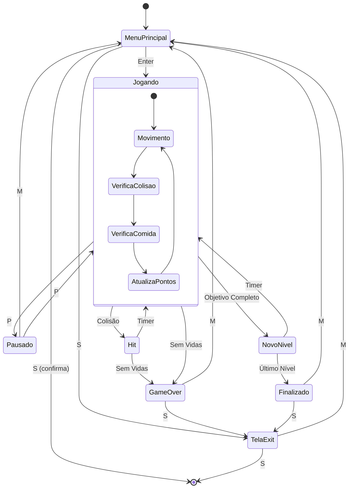

# Diagrama de Estados

# Detalhamento dos Estados

## Estados Principais

1. **MenuPrincipal** (SCREEN_MENU)
   - Estado inicial do jogo
   - Permite seleção de dificuldade
   - Mostra controles e opções

2. **Jogando** (statusGame == ON)
   - Loop principal do jogo
   - Controle da cobra
   - Atualização de física

3. **Pausado** (SCREEN_PAUSE)
   - Jogo em pausa
   - Mantém estado atual
   - Permite retorno ou saída

4. **Hit** (SCREEN_HIT)
   - Após colisão
   - Mostra vidas restantes
   - Timer de recuperação

5. **NovoNivel** (SCREEN_LEVEL)
   - Transição entre níveis
   - Mostra progresso
   - Ajusta dificuldade

6. **GameOver** (SCREEN_GAMEOVER)
   - Fim de jogo
   - Mostra pontuação
   - Opções de reinício

7. **TelaExit** (SCREEN_EXIT)
   - Confirmação de saída
   - Opção de retorno

8. **Finalizado** (SCREEN_FINISHED)
   - Jogo completado
   - Congratulações
   - Pontuação final

## Sub-estados do Estado "Jogando"

1. **Movimento**
   - Atualização de posição
   - Input do usuário
   - Física da cobra

2. **VerificaColisao**
   - Colisão com bordas
   - Colisão com próprio corpo
   - Determina perda de vida

3. **VerificaComida**
   - Detecção de coleta
   - Crescimento da cobra
   - Nova posição da comida

4. **AtualizaPontos**
   - Cálculo de pontuação
   - Multiplicadores
   - Progresso do nível

# Transições

## Transições por Tecla
- **P**: Alterna entre Jogando e Pausado
- **M**: Retorna ao Menu Principal
- **S**: Acessa tela de saída
- **Enter**: Inicia jogo
- **I**: Toggle informações

## Transições Automáticas
- Timer em Hit ? Jogando
- Timer em NovoNivel ? Jogando
- Colisão em Jogando ? Hit
- Sem vidas em Hit ? GameOver
- Objetivo completo em Jogando ? NovoNivel
- Último nível completo ? Finalizado

# Estados de Debug

Em modo debug (-show ou -log):
- Informações adicionais em cada estado
- Logging de transições
- Dados de performance
