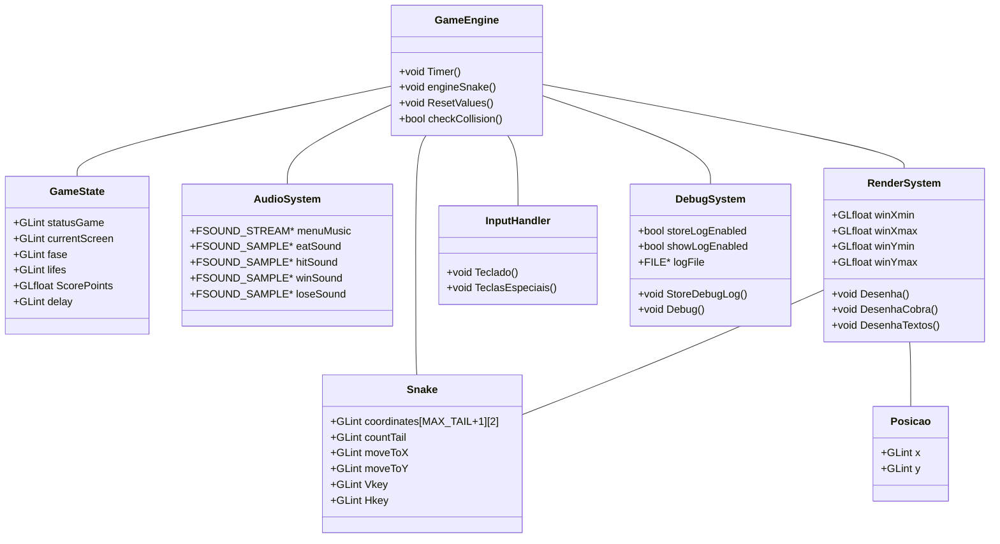

# Diagrama de Classes e Estruturas

# Descrição das Classes e Estruturas

## Estruturas de Dados Básicas

### Posicao
- Estrutura para armazenar coordenadas 2D
- Usada principalmente para a posição da comida
- Membros:
  - `x`: Coordenada horizontal
  - `y`: Coordenada vertical

### Snake
- Representa a cobra e seus segmentos
- Armazena posições e estado de movimento
- Membros:
  - `coordinates`: Array de posições dos segmentos
  - `countTail`: Tamanho atual da cobra
  - `moveToX/Y`: Direção do movimento
  - `Vkey/Hkey`: Estado das teclas

## Sistemas Principais

### GameState
- Controla o estado geral do jogo
- Gerencia pontuação e progressão
- Membros:
  - `statusGame`: Estado ativo/inativo
  - `currentScreen`: Tela atual
  - `fase`: Nível atual
  - `lifes`: Vidas restantes
  - `ScorePoints`: Pontuação
  - `delay`: Velocidade do jogo

### AudioSystem
- Gerencia todos os efeitos sonoros
- Controla música de fundo
- Membros:
  - Diferentes tipos de som (FMOD)
  - Controles de volume
  - Estados de reprodução

### RenderSystem
- Sistema de renderização OpenGL
- Gerencia a interface gráfica
- Métodos:
  - `Desenha()`: Renderização principal
  - `DesenhaCobra()`: Renderiza a cobra
  - `DesenhaTextos()`: Renderiza UI

### GameEngine
- Núcleo da lógica do jogo
- Controla física e regras
- Métodos:
  - `Timer()`: Loop principal
  - `engineSnake()`: Lógica da cobra
  - `ResetValues()`: Reinicialização
  - `checkCollision()`: Detecção de colisões

## Sistemas de Suporte

### InputHandler
- Processa entrada do usuário
- Gerencia controles
- Métodos:
  - `Teclado()`: Teclas normais
  - `TeclasEspeciais()`: Teclas especiais

### DebugSystem
- Sistema de debugging e logging
- Auxilia desenvolvimento
- Membros:
  - `storeLogEnabled`: Ativa logging
  - `showLogEnabled`: Mostra debug
  - `logFile`: Arquivo de log
- Métodos:
  - `StoreDebugLog()`: Registra eventos
  - `Debug()`: Mostra informações

# Relações entre Componentes

1. **GameEngine ? GameState**
   - Atualiza estado do jogo
   - Controla progressão

2. **GameEngine ? Snake**
   - Atualiza posições
   - Gerencia crescimento

3. **GameEngine ? AudioSystem**
   - Dispara efeitos sonoros
   - Controla música

4. **RenderSystem ? Snake**
   - Renderiza segmentos
   - Atualiza visual

5. **GameEngine ? DebugSystem**
   - Registra eventos
   - Monitora estado

# Notas de Implementação

1. **Otimizações**
   - Uso de arrays fixos para performance
   - Minimização de alocação dinâmica
   - Cache de posições

2. **Manutenibilidade**
   - Separação de responsabilidades
   - Interfaces claras
   - Logging extensivo

3. **Extensibilidade**
   - Sistema modular
   - Fácil adição de features
   - Debug incorporado
