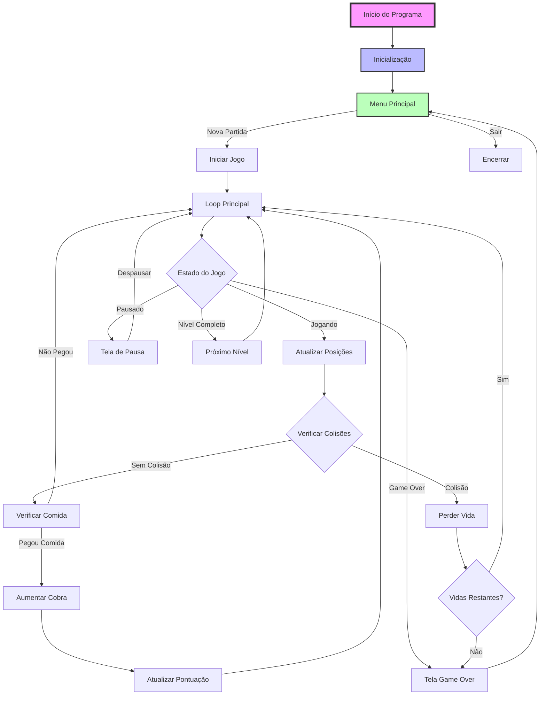

# Diagrama de Fluxo do Jogo

# Legenda

## Cores
- Rosa: Entrada do programa
- Azul claro: Inicialização
- Verde claro: Estados principais

## Tipos de Nós
- Retângulos: Processos
- Losangos: Decisões
- Círculos: Conectores

## Fluxos
- Setas sólidas: Fluxo principal
- Setas tracejadas: Fluxo alternativo

# Descrição Detalhada

1. **Início do Programa**
   - Carregamento das bibliotecas
   - Verificação de parâmetros de linha de comando

2. **Inicialização**
   - Setup do OpenGL
   - Carregamento de recursos de áudio
   - Inicialização de variáveis

3. **Menu Principal**
   - Interface do usuário
   - Seleção de dificuldade
   - Opções de jogo

4. **Loop Principal**
   - Gerenciamento de estados
   - Atualização de física
   - Renderização

5. **Sistema de Colisões**
   - Verificação de bordas
   - Verificação de auto-colisão
   - Gerenciamento de vidas

6. **Sistema de Níveis**
   - Progressão de dificuldade
   - Objetivos por nível
   - Condições de vitória
