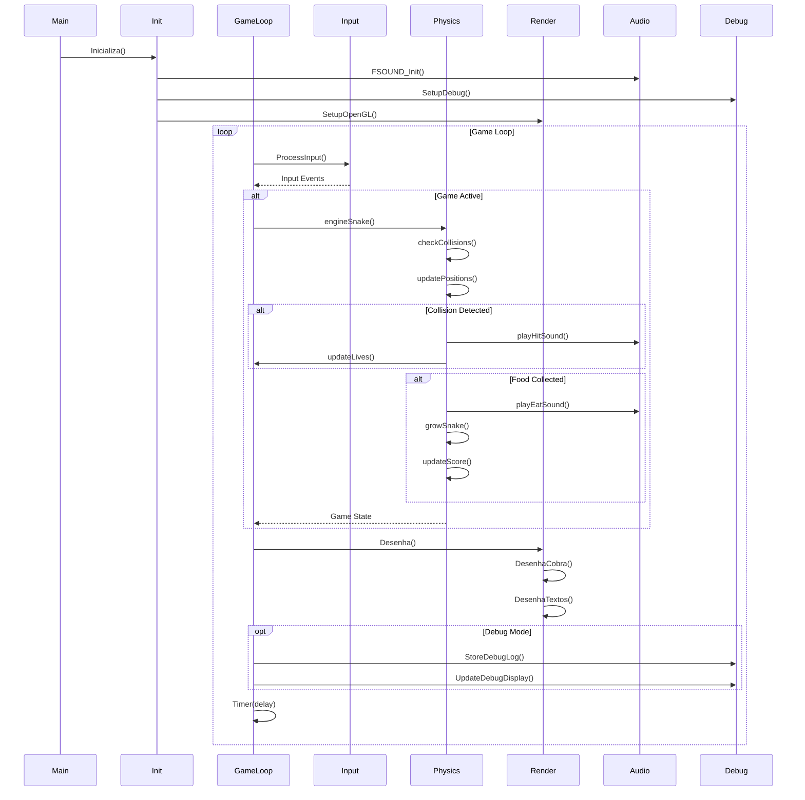
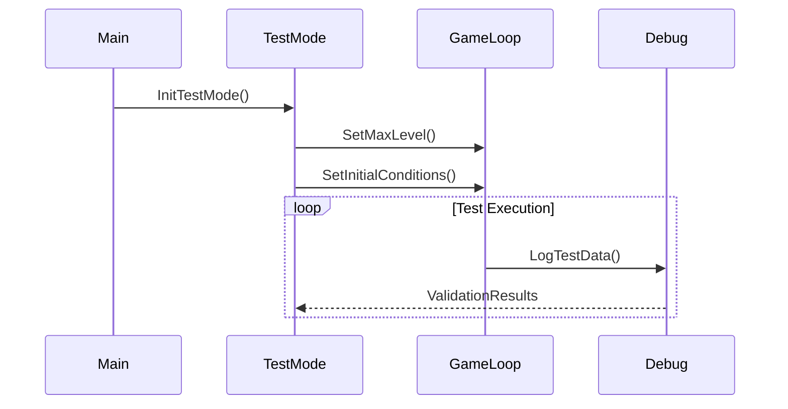
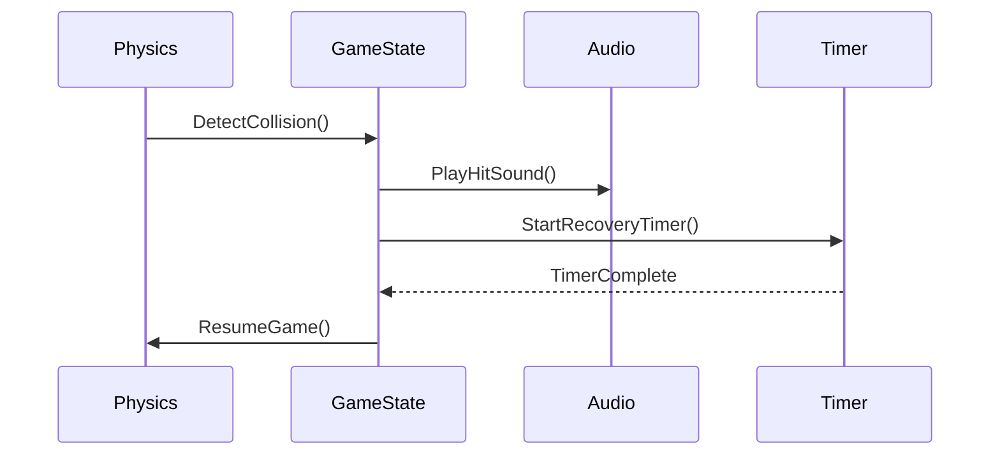
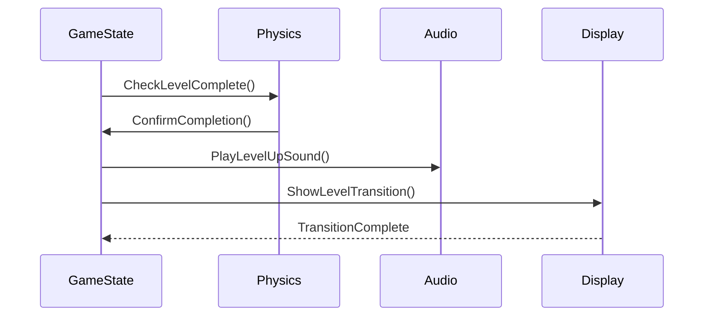

# Diagrama de Sequência

# Detalhamento das Sequências

## 1. Inicialização

### Sequência Principal
1. `Main` inicia o programa
2. `Init` configura sistemas
3. Setup de áudio (FMOD)
4. Configuração OpenGL
5. Inicialização de variáveis

### Componentes Envolvidos
- Sistema principal
- Sistema de áudio
- Sistema de renderização
- Sistema de debug

## 2. Loop Principal do Jogo

### Ciclo de Vida
1. Processamento de Input
2. Atualização de física
3. Renderização
4. Debug (se ativo)

### Input
- Teclas direcionais
- Comandos de controle
- Estado do jogo

### Física
1. Verificação de colisões
2. Atualização de posições
3. Crescimento da cobra
4. Pontuação

### Renderização
1. Limpeza do buffer
2. Desenho da cobra
3. Desenho da comida
4. Interface do usuário

## 3. Eventos do Jogo

### Colisões
1. Detecção
2. Efeito sonoro
3. Atualização de vidas
4. Reset de posição

### Coleta de Comida
1. Verificação de posição
2. Som de coleta
3. Crescimento
4. Nova posição da comida

### Mudança de Nível
1. Verificação de objetivo
2. Atualização de estado
3. Ajuste de dificuldade
4. Reset de posições

## 4. Sistema de Debug

### Logging
1. Registro de eventos
2. Estado do jogo
3. Posições
4. Performance

### Display
1. Informações na tela
2. Estado atual
3. Variáveis importantes
4. Contadores

# Fluxos Especiais

## 1. Modo Teste

## 2. Recuperação de Colisão

## 3. Transição de Nível

# Notas de Implementação

1. **Timing**
   - Uso de Timer para controle de FPS
   - Separação entre física e render
   - Controle de estados temporais

2. **Estado do Jogo**
   - Máquina de estados clara
   - Transições bem definidas
   - Persistência de dados

3. **Debug**
   - Logging não-bloqueante
   - Informações em tempo real
   - Rastreamento de eventos
